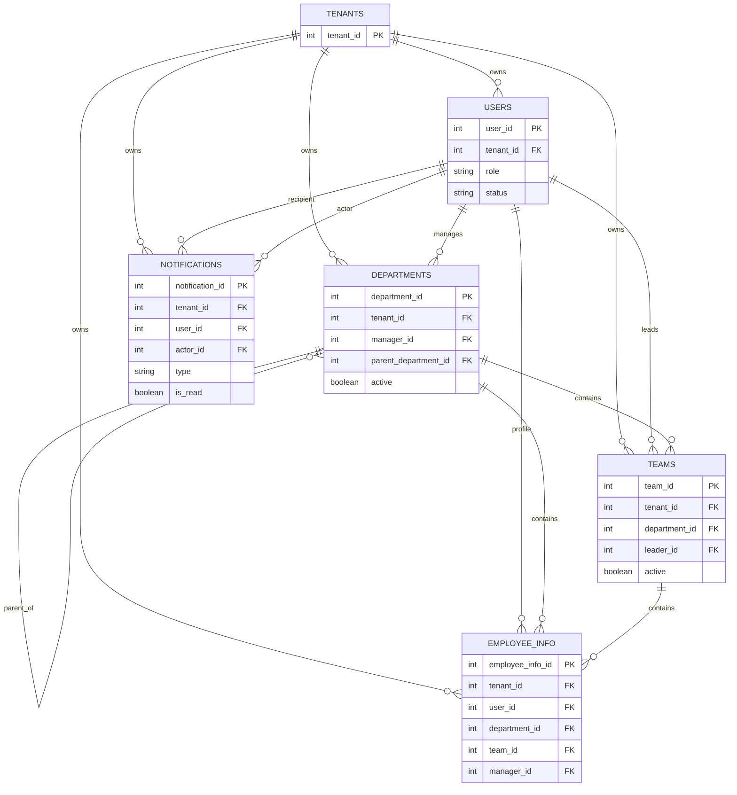
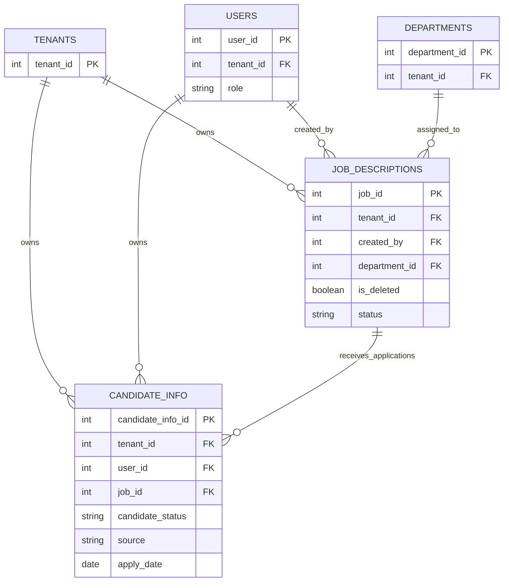
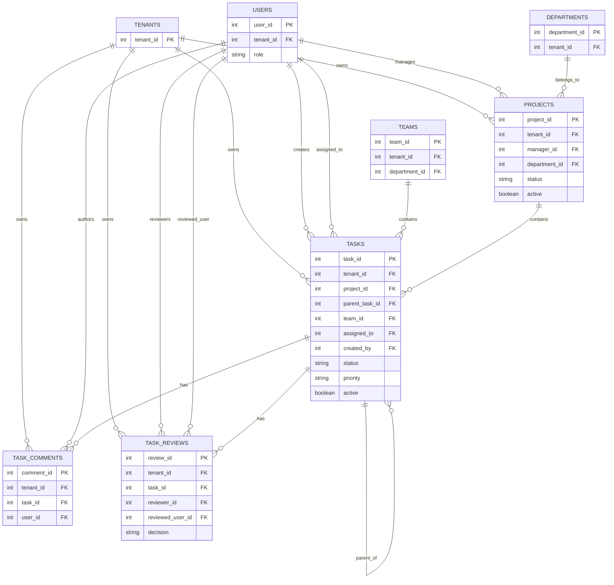
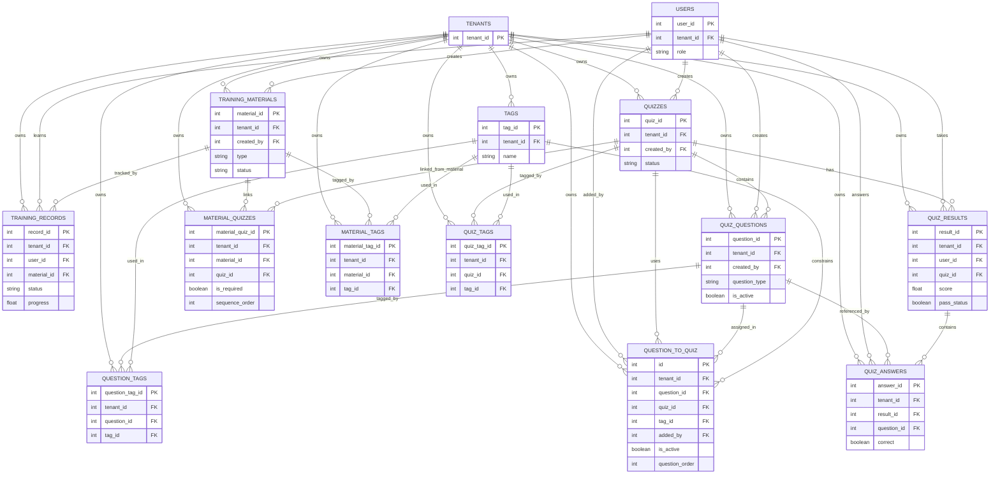
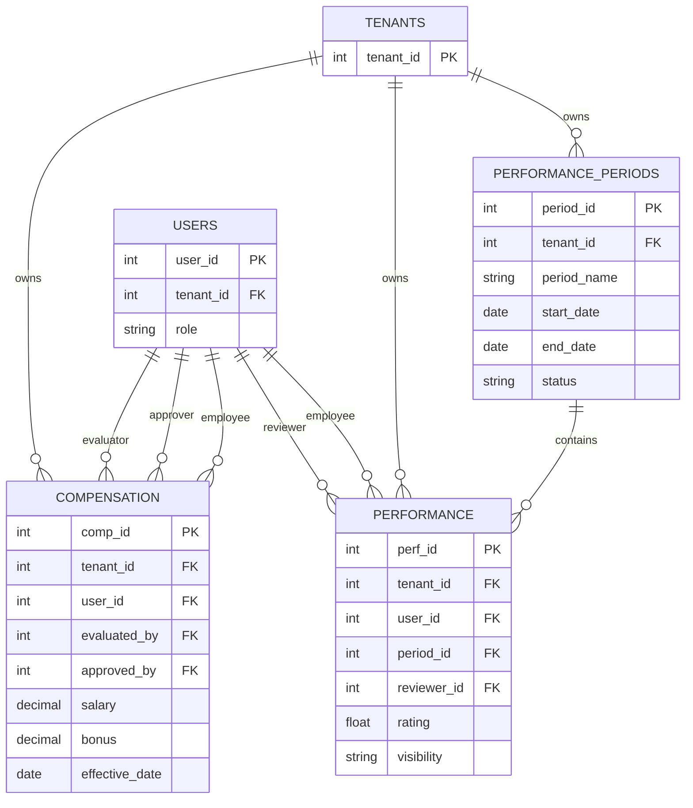

# ERD theo module

Tai lieu nay ve cac model trong backend va chia ERD theo module de de doc va de dua vao bao cao.

## 1) Core he thong

Diagram nay gom cac bang nen tang duoc dung chung boi nhieu module: tenant, nguoi dung, phong ban, team, thong tin nhan vien, thong bao.

## 2) Module tuyen dung

Module nay bao gom job description va candidate.

## 3) Module quan ly cong viec

Module nay gom project, task, comment va review.

## 4) Module dao tao va quiz

Module nay gom tai lieu dao tao, tag, quiz, cau hoi, ket qua va bang lien ket.

## 5) Module danh gia va luong thuong

Module nay gom ky danh gia hieu suat va dieu chinh luong thuong.

## Ghi chu

- Mot so bang trung gian nhu Material_Quizzes, Material_Tags, QuizTags, QuestionTags, Question_To_Quiz dung de the hien quan he many-to-many.
- Tenant_id xuat hien o gan nhu tat ca bang de dam bao pham vi du lieu theo tenant.
- Neu ban muon, toi co the tach moi module ra mot file rieng hoac chuyen tat ca sang ERD tong quan mot trang.